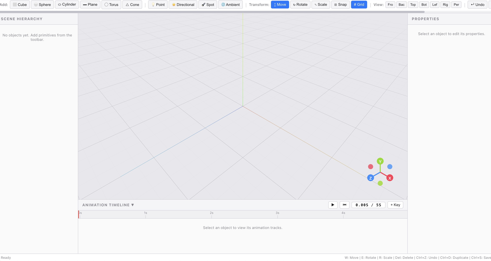

# splineME — 3D Editor

A lightweight 3D editor in the browser for creating and animating scenes.



## Features

### Scene Building
- Add primitives: Cube, Sphere, Cylinder, Plane, Torus, Cone
- Lights: Point, Directional, Spot, Ambient
- Import 3D Models from GLB/GLTF files

### Skeletal Animation
- Automatic bone detection on imported models
- Procedural dance animations for characters
- Leg/arm/tail/head bone animations
- Supports models with or without built-in animations

### Transform & Manipulation
- Move, Rotate, Scale tools
- Snap to grid for precise placement
- Toggle grid visibility

### Scene Management
- Scene Hierarchy panel to manage all objects
- Properties panel to edit object details
- Undo support

### Animation
- Timeline-based keyframe animation
- Play, scrub, and set custom keyframes

### Viewports
- Multi-angle views: Front, Back, Top, Bottom, Left, Right, Perspective

### Keyboard Shortcuts
- W: Move, E: Rotate, R: Scale, Del: Delete
- Ctrl+Z: Undo, Ctrl+D: Duplicate, Ctrl+S: Save

## Getting Started

```bash
npm install
npm run dev
```
