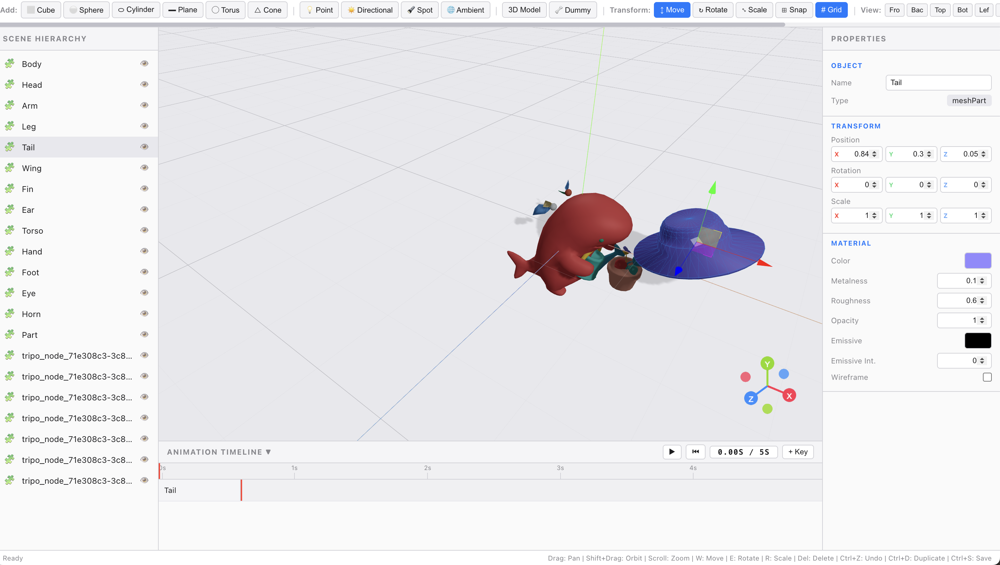

# 3D Studio

A browser-based 3D editor for building, animating, and dissecting scenes — built with React, Three.js, and Zustand.


## Features

### Scene Building
- Add primitives: Cube, Sphere, Cylinder, Plane, Torus, Cone
- Lights: Point, Directional, Spot, Ambient
- Import 3D models from GLB / GLTF files
- Scene hierarchy panel with rename, duplicate, hide, and delete

### Model Part-Splitting (拆件)
Break a model into independently movable, color-coded parts — the same idea
behind Meshy / Tripo's "split" feature.



- **Connected-components analysis** (Union-Find) splits multi-piece models
  instantly and losslessly.
- **Long-edge-breaking heuristic** (adjustable sensitivity slider) cuts
  single-piece meshes apart at thin connections (necks, fin bases, joints).
- Each part becomes a standalone object with its own transform, material, and
  animation track; undo restores the original model.
- Implemented in `src/three/splitGeometry.ts` + `src/three/geometryRegistry.ts`.

### Skeletal Animation
- **Hardcoded rig + auto-skinning** (not full auto-rigging):
  - The skeleton topology and bone positions are hand-authored for the default
    shark model in `src/three/sharkWalkRig.ts` (`SHARK_BONE_ORDER` + offsets
    measured from the GLB's bounding box).
  - Skin weights are computed automatically at runtime: each vertex is bound to
    its two nearest bones by **inverse-square distance** (`SharkDance.tsx:buildRig`),
    so a static GLB mesh with no pre-existing rig can still be deformed.
  - This is **not** a general auto-rigger — swapping in a different GLB will
    place the bones in the wrong spots. For arbitrary models you'd need a real
    auto-rig algorithm (Pinocchio, medial-axis, or an AI rigger).
- Procedural walk / dance cycles drive the shark bones (leg swing, tail wag,
  spine bob, head counter-motion).
- Works on models with or without built-in animations.
- Skeleton preview thumbnail in the properties panel.

### Transform & Manipulation
- Move, Rotate, Scale gizmos
- Snap-to-grid for precise placement; toggle grid visibility
- Multi-angle viewports: Front, Back, Top, Bottom, Left, Right, Perspective

### Animation Timeline
- Keyframe-based timeline: play, scrub, set custom keyframes
- Per-object animation tracks with linear interpolation

### Scene Management
- Undo / Redo history
- Save / Load scenes as JSON
- Export to GLTF
- Post-processing effects: Bloom, Vignette

### Keyboard Shortcuts
- `W` Move · `E` Rotate · `R` Scale · `Del` Delete
- `Ctrl+Z` Undo · `Ctrl+Shift+Z` Redo · `Ctrl+D` Duplicate · `Ctrl+S` Save

### Viewport Navigation
- Left-drag to pan · **Shift+drag** to orbit · scroll to zoom

## Tech Stack
React 19 · Three.js · @react-three/fiber · @react-three/drei · Zustand · Vite · TypeScript

## Getting Started
```bash
npm install
npm run dev      # start the dev server
npm run build    # production build
```
